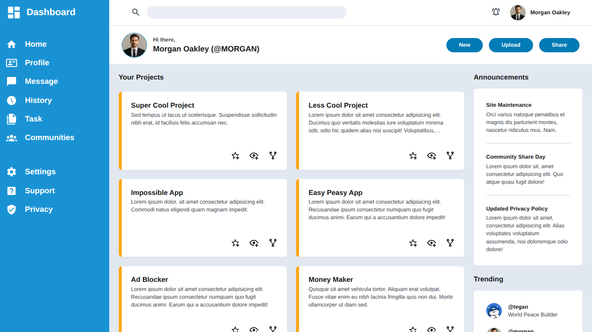

## README.md

# The Admin Dashboard

A modern and clean admin dashboard built with **HTML** and **Tailwind CSS**, featuring a sidebar navigation, project management cards, announcements panel, and a responsive layout.



---

## 📋 Features

- **Sidebar Navigation** — Fixed sidebar with icon-based menu items (Home, Profile, Message, History, Task, Communities, Settings, Support, Privacy)
- **Sticky Header** — Navbar with search bar, notification icon, and user profile that stays in place while scrolling
- **Project Cards** — Grid-based project cards with action buttons (star, view, share) and accent left border
- **Announcements Panel** — Side panel for announcements, positioned alongside the project grid
- **Scrollable Content Area** — Only the main workspace scrolls while the navbar and greeting section remain fixed
- **Responsive Grid** — 12-column grid system for flexible layout (9-column projects + 3-column announcements)
- **Custom Design Tokens** — Consistent spacing (`gap-gutter`, `p-gutter`), shadows (`custom-shadow`), and typography scales

---

## 🛠️ Tech Stack

| Technology | Purpose |
|------------|---------|
| HTML5 | Structure & semantics |
| Tailwind CSS | Utility-first styling |
| Material Symbols | Icon library |
| Custom SVGs | Sidebar menu icons |

---

## 📁 Project Structure

```
The_Admin_dashboard/
├── assets/
│   ├── css/
│   │   └── output.css          # Compiled Tailwind CSS
│   └── images/
│       └── Nailed it_.jpeg     # Profile image
├── index.html                  # Main dashboard page
├── tailwind.config.js          # Tailwind configuration & custom tokens
├── postcss.config.js           # PostCSS configuration
├── package.json                # Dependencies & scripts
└── README.md
```

---

## 🚀 Getting Started

### Prerequisites

- [Node.js](https://nodejs.org/) (v16 or higher)
- npm or yarn

### Installation

1. **Clone the repository**

   ```bash
   git clone https://github.com/Kazumi500/The_Admin_dashboard.git
   cd The_Admin_dashboard
   ```

2. **Install dependencies**

   ```bash
   npm install
   ```

3. **Run the development server**

   ```bash
   npx tailwindcss -i ./src/input.css -o ./assets/css/output.css --watch
   ```

4. **Open in browser**

   Open `index.html` in your browser or use a local server:

   ```bash
   npx serve .
   ```

---

## 🎨 Custom Design Tokens

This project uses custom Tailwind tokens defined in `tailwind.config.js`:

### Colors

| Token | Example |
|-------|---------|
| `primary` | `#006290` |
| `primary-container` | `#D1E4FF` |
| `on-surface` | `#1B1B1F` |
| `on-surface-variant` | `#44474E` |
| `blue-1` | Sidebar background |

### Spacing

| Token | Usage |
|-------|-------|
| `gutter` | Consistent gap & padding across components |
| `margin-desktop` | Horizontal margin for desktop layout |

### Typography

| Token | Size |
|-------|------|
| `title-lg` | Large titles |
| `headline-sm` | Small headlines |
| `body-sm` | Body text |
| `label-md` / `label-sm` | Labels & captions |

---

## 📝 Notes

- The sidebar uses inline SVG icons from [Material Design Icons](https://pictogrammers.com/library/mdi/)
- The navbar uses [Material Symbols Outlined](https://fonts.google.com/icons) for search and notification icons
- Project cards use a `card-accent-left` utility class for the left border accent
- Scroll behavior is isolated to the main workspace area using `flex-1 overflow-y-auto` on the content wrapper

---

## 📄 License

This project is open source and available under the [MIT License](LICENSE).

---

## 👤 Author

**Kazumi500**

- GitHub: [Kazumi500](https://github.com/Kazumi500)
```
